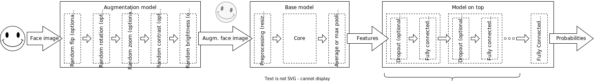

# skillbox-computer-vision-project
## Skillbox. Дипломная работа по компьютерному зрению. Распознавание эмоций человека.

В рамках данной дипломной работы был разработан ноутбук, с помощью которого можно создать готовую к использованию модель распознавания эмоций по изображению лица человека. Создание модели происходит с использованием механизмов *Transfer Learning* и *Fine Tuning*. Т.е. модель создается не с нуля, а на базе обученной модели классификации изображений, т.н. *базовой модели*. В качестве *базовой модели* может выступать любая модель из библиотеки *Keras Applications*, обученная на датасете *ImageNet*. Выбор базовой модели осуществляется, исходя из точности её предсказаний на датасете *ImageNet* и измеренной скорости инференса модели в целом (подробнее см. описание этапа "Выбор базовой модели").



Процесс создания системы разделен на три независимых стадии (пайплайна), которые выполняются последовательно:
1. Предобработка изображений (`IMAGE_PREPROCESSING_PIPELINE`).
2. Сбор информации о базовых моделях в Keras Applications (`KERAS_BASE_MODELS_PROCESSING_PIPELINE`).
3. Создание модели (`MODEL_BUILDING_PIPELINE`).

Каждый пайплайн в свою очередь состоит из нескольких этапов, которые также должны выполняться последовательно.

Любой этап на усмотрение пользователя может выполняться как на локальном компьютере в JupyterNotebook или JupyterLab, так и удаленно в Google Colab. Платформа для выполнения этапа задается в его настройках (параметр `platform`). Такая опция позволяет выполнять этапы на наиболее подходящей платформе. Например, этапы, которые не требуют использования GPU целесообразнее выполнять на локальном компьютере. И наоборот, в случае отсутствия на локальном компьютере подходящего для машинного обучения GPU, этапы, в рамках выполнения которых производится работа с базовой моделью, целесообразно выполнять в Google Colab.

Для того чтобы облегчить переключение между платформами, все данные сохраняются в едином облачном хранилище Google Диск. Поэтому перед началом работы с ноутбуком необходмо создать "пустое" хранилище в Google Диск, установить на локальный компьютер приложение Google Диск и подключить подготовленное облачное хранилище в качестве логического диска локального компьютера. 

Для повышения удобства использования ноутбука при каждом его запуске происходит автоматическая установка пакетов, необходимых для его работы на конкретной платформе.

Модель обучается на размеченном датасете изображений лиц с метками в виде названий эмоций, которые выражают лица. Датасет должен представлять собой файлов, распределённых по папкам с названиями эмоций, размещен в виде архива в облачном хранилище Google Диск.

В метрики качества обучения модели используется точность её предсказаний на отдельном тестовом датасете. Такой датасет также как и тренировочный должен быть упакован в архив. Для проверки точности предсказаний на тестовом датасете используется платформа Kaggle. Для этого в ноутбуке создан специальный класс `Kaggle`, который используя [Kaggle API](https://github.com/Kaggle/kaggle-api), реализует отправку на проверку файла с предсказаниями модели в виде csv-файла и прием результатов проверки публичной (Public) и приватной (Private) части предсказаний. Метрикой качества работы модели рассчитывается как среднее значения этих оценок. Для подключения к платформе Kaggle, необходимо зарегистрироваться на этой платформе и принять участие в соревновании [skillbox-computer-vision-project](https://www.kaggle.com/c/skillbox-computer-vision-project).

### Примеры использования

В репозитории находятся папки
```
PROJECT_NAME = 'skillbox-computer-vision-project' # Название проекта
LOCAL_PROJ_PATH = f'D:/{PROJECT_NAME}' # Путь к папке проекта на локальном компьютере
COLAB_PROJ_PATH = f'/content/{PROJECT_NAME}' # Путь к папке проекта в сессионном хранилище Google Colab
LOCAL_GD_PROJ_PATH = f'G:/Мой диск/{PROJECT_NAME}' # Путь к папке проекта на Google Диске'е на локальном компьютере
COLAB_GD_PROJ_PATH = f'/content/drive/MyDrive/{PROJECT_NAME}' # Путь к папке проекта на Google Диск'е в Google Colab
TRAIN_DATASET_PATH = 'train' # Путь к исходному тренировочному датасету внутри папки проекта
TEST_DATASET_PATH = 'test_kaggle' # Путь к исходному тестовому датасету внутри папки проекта
TRAIN_DATASET_URL = 'https://drive.google.com/file/d/1TG9P5B2k3eTbC4XDxDmEc07dyAORPC16/view?usp=sharing' # Ссылка на архив тренировочного датасета
TRAIN_DATASET_EXT = 'zip' # Тип (расширение файла) архива тренировочного датасета
TEST_DATASET_URL = 'https://drive.google.com/file/d/12QrDrLT1F-X7UycvOoApXFqxTw3Zx93K/view?usp=sharing' # Ссылка на архив тестового датасета
TEST_DATASET_EXT = 'zip' # Тип (расширение файла) архива тестового датасета
KAGGLE_API_TOKEN_URL = 'https://drive.google.com/file/d/1EzdFbMawx7bmAU9ze_sxL-1yBf2SPrg-/view?usp=sharing' # Ссылка на токен для подключения к платформе Kaggle через API
MAX_INFERENCE_TIME = .33 # Максимально допустимое время инференса модели в секундах
INFERENCE_TIME_WEIGHT = .6 # Вес времени инференса при выборе базовой модели
BASE_MODEL_MAX_SIZE = 64 # Максимально допустимый размер базовой модели в МБ
BASE_MODEL_POOLINGS = 'avg' # Тип пулинга на выходе базовой моделей ('avg' - average, 'max' - max)
MODEL_ON_TOP_DENSE_NUMS = [1, 2] # Варианты количества дополнительных полносвязных слоев
MODEL_ON_TOP_DENSE_UNITS = [1024, 2048] # Варианты количества выходных нейронов в дополнительном полносвязном слое
MODEL_ON_TOP_DROPOUT_RATES = [.0, .2] # Варианты доли исключаемых данных перед подачей в полносвязный слой при обучении
OPTIMIZER = 'Adam' # Название оптимизатора, используемого при обучении модели
MODEL_ON_TOP_INITIAL_LEARNING_RATE = 1e-4 # Начальная скорость обучения полносвязной модели
MODEL_ON_TOP_LEARNING_RATE_DECAY_RATE = 0.96 # Коэффициент изменения скорости обучения полносвязной модели по окончании каждой эпохи
MODEL_INITIAL_LEARNING_RATE = 2e-5 # Начальная скорость обучения модели при тонкой настройке
MODEL_LEARNING_RATE_DECAY_RATE = 0.96 # Коэффициент изменения скорости обучения модели по окончании каждой эпохи при тонкой настройке
SEED = 123 # Инициализатор генератора случайных чисел
VERBOSE = 1 # Режим верболизации (0-тийхий, 1-вывод сообщений)
```
